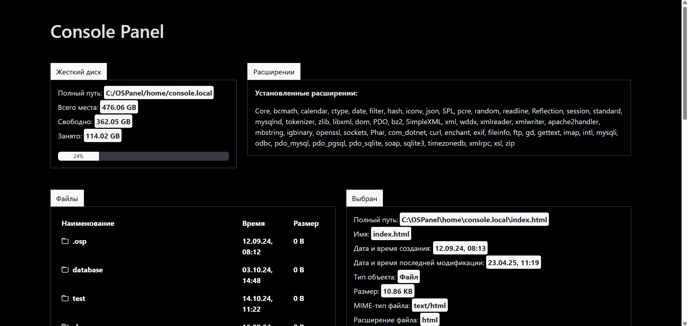

# 🖥️ Okki Console Panel

A lightweight local web-based file explorer and environment diagnostics tool.  
It displays system info, file/folder structure, extensions, and lets you preview or edit code output from files — all in one dashboard.

---

## 🔧 Features

- 💾 **Disk Overview**
  - Total, free, and used space with a progress bar
  - Current working directory path

- 📂 **Directory Scanner**
  - Lists all files and folders with name, size, and last modified time
  - Folders are sorted first
  - Folder navigation (`...`) enabled
  - Accurate size calculation with nested folder scan

- 📑 **File Details Panel**
  - Displays path, name, creation/modification time, MIME type, file extension, and MD5 hash

- 🔍 **Loaded PHP Extensions**
  - Lists all currently active PHP extensions on the system

- 📝 **Code Preview**
  - Bottom editor area shows code (HTML, PHP, JS, etc.)
  - Code can be copied, previewed, or executed via integration

---

## 📦 Technologies

- PHP (recursive directory scanner, file info, disk usage)
- JavaScript (interactive UI, highlighting, clipboard)
- Bootstrap 5.3 (UI layout)
- FontAwesome / Bootstrap Icons (optional)
- HTML/CSS (responsive grid layout)

---

## 👨‍💻 Author

**Temirkhan**  
GitHub: [DreamerView](https://github.com/DreamerView)

---

## 📄 License

MIT License — Free to use, modify, and distribute.
